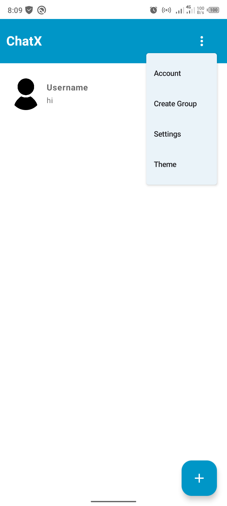
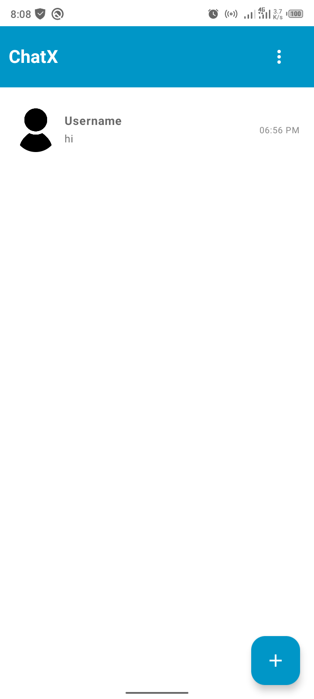
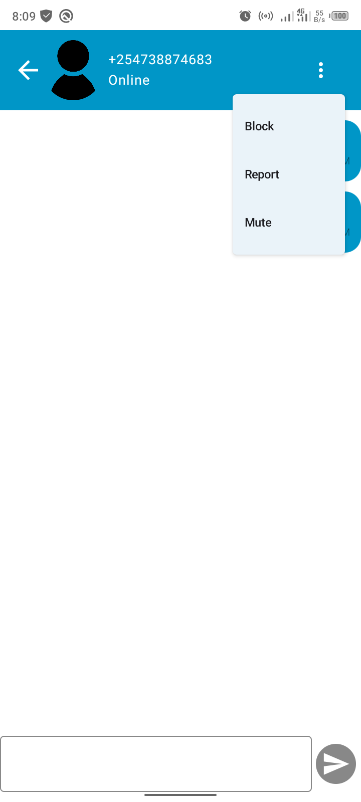

# ChatX

ChatX is a real-time chat application built with **Kotlin**, **Jetpack Compose**, and **Firebase**. It's designed to offer a modern, fast, and reliable chatting experience for Android users.

## 🚀 Key Features

- 📱 **Phone Authentication** via Firebase Auth  
- 💬 **Real-Time Messaging** powered by Firebase Realtime Database  
- 🗃️ **Room Database** for local data caching and offline support  
- 🎨 **Jetpack Compose** for clean, modern UI design  
- 🔒 **Secure and Scalable Architecture**

## 🧰 Tech Stack

- **Kotlin** - Primary development language  
- **Jetpack Compose** - For building beautiful UI  
- **Firebase Authentication** - Phone number sign-in  
- **Firebase Realtime Database** - Instant message sync  
- **Room Database** - Local persistence layer

## 📸 Screenshots

<!-- You can add screenshots here -->
<p align="center">
  
  
  
  
  
</p>

## 📦 Installation

1. **Clone the repository**

```bash
git clone https://github.com/Nic3holas-wq/ChatX.git
```
2. **Open in Android Studio**

File > Open > Select the project folder

3. **Connect Firebase**

Go to Firebase Console

Create a new project

Enable Phone Authentication

Set up Realtime Database

Download the google-services.json file and place it in the app/ directory

4. **Run the app**

Sync Gradle files

Build and run on an emulator or physical device

**🤝 Contributing**

Contributions are welcome! Feel free to fork the repository, submit pull requests, or open issues.
